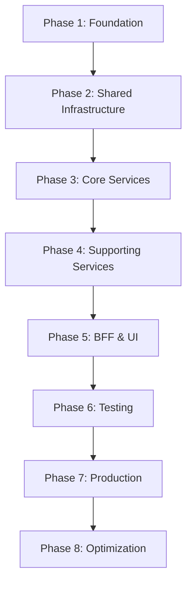

# 🚀 Azure Container Apps Migration Plan

**Project:** xshopai Platform Infrastructure Modernization  
**Target Architecture:** Azure Container Apps with Bicep IaC  
**Duration:** 8 Weeks  
**Last Updated:** January 16, 2026

---

## 📋 Complete Migration Plan (8-Week Roadmap)

### Phase 1: Foundation Setup (Week 1)

**Goals:**
- Set up Bicep Registry in ACR
- Create core reusable modules
- Establish naming conventions

**Tasks & Deliverables:**
- ✅ Core modules created (15 modules in `modules/`)
- ✅ Module validation completed (all 15 modules validated)
- ✅ Documentation for module usage (comprehensive README.md)
- ⏳ Bicep Registry configured in ACR
- ⏳ Modules published to ACR registry (v1.0.0)
- ⏳ GitHub Actions workflow for publishing modules
- ⏳ Module versioning strategy documented

**Status:** 🟡 **85% Complete** (infrastructure created, deployment pending)

**What's Done:**
- ✅ 16 reusable Bicep modules created in `modules/`
- ✅ Bootstrap infrastructure files created in `bootstrap/`
- ✅ 2 GitHub Actions workflows created:
  - `bootstrap-infrastructure.yml` - Deploy ACR (run ONCE)
  - `publish-bicep-modules.yml` - Publish modules (run on changes)
- ✅ PowerShell publishing script created
- ✅ Comprehensive documentation (README.md, BOOTSTRAP.md)
- ✅ All changes committed to git

**What's Pending (15%):**
- ⏳ Execute bootstrap workflow to deploy ACR to Azure
- ⏳ Execute publish workflow to publish modules to ACR
- ⏳ Verify module references work from ACR

**Next Actions:**
1. **Run Bootstrap Workflow** (GitHub Actions or manual Azure CLI)
2. **Run Publish Modules Workflow** to publish all 16 modules
3. **Verify** modules are accessible via `br:` references

---

### Phase 2: Shared Infrastructure Refactoring (Week 2)

**Goals:**
- Separate shared resources from service-specific resources
- Deploy shared infrastructure once for all services

**Tasks & Deliverables:**
- ⏳ Create `environments/dev/main.bicep` orchestration file
- ⏳ Create `environments/dev/main.bicepparam` parameter file
- ⏳ Create `environments/prod/main.bicepparam` parameter file
- ⏳ Define shared vs. service-specific resource boundaries
- ⏳ Deploy platform infrastructure to dev environment
- ⏳ Validate shared infrastructure deployment
- ⏳ Store infrastructure outputs in Key Vault (for service consumption)

**Status:** 🔴 **Not Started** (0%)

---

### Phase 3: Service Migration - Core Services (Week 3-4)

**Goals:**
- Migrate critical services to new architecture
- Establish application deployment pattern

**Tasks & Deliverables:**
- ⏳ Create `.azure/` deployment folder structure for each service
- ⏳ Migrate **product-service** (Python/FastAPI)
  - ⏳ Create `deploy.bicep`
  - ⏳ Create parameter files (dev/prod)
  - ⏳ Create GitHub Actions workflow
  - ⏳ Deploy to dev and validate
- ⏳ Migrate **user-service** (Node.js/Express)
- ⏳ Migrate **auth-service** (Node.js/Express)
- ⏳ Migrate **cart-service** (Java/Spring Boot)
- ⏳ Document service deployment pattern in each service README

**Status:** 🔴 **Not Started** (0%)

---

### Phase 4: Service Migration - Supporting Services (Week 5)

**Goals:**
- Migrate remaining microservices
- Ensure all services operational

**Tasks & Deliverables:**
- ⏳ Migrate **order-service** (.NET/C#)
- ⏳ Migrate **order-processor-service** (Java/Spring Boot)
- ⏳ Migrate **payment-service** (.NET/C#)
- ⏳ Migrate **inventory-service** (Python/FastAPI)
- ⏳ Migrate **review-service** (Node.js/Express)
- ⏳ Migrate **notification-service** (Node.js/Express)
- ⏳ Migrate **audit-service** (Node.js/Express)
- ⏳ Migrate **chat-service** (Node.js/Express)

**Status:** 🔴 **Not Started** (0%)

---

### Phase 5: BFF & UI Migration (Week 6)

**Goals:**
- Migrate frontend services to Container Apps
- Establish CDN/static site hosting pattern

**Tasks & Deliverables:**
- ⏳ Migrate **web-bff** (Node.js/Express)
- ⏳ Migrate **customer-ui** (React SPA)
  - ⏳ Static site hosting via Azure Static Web Apps or Container Apps
  - ⏳ CDN configuration
- ⏳ Migrate **admin-ui** (React SPA)
- ⏳ Update CORS policies for Container Apps
- ⏳ Configure custom domains (if applicable)

**Status:** 🔴 **Not Started** (0%)

---

### Phase 6: Testing & Validation (Week 7)

**Goals:**
- End-to-end testing across all services
- Performance benchmarking
- Security validation

**Tasks & Deliverables:**
- ⏳ Integration testing (all 12 services)
- ⏳ Load testing (performance validation)
- ⏳ Security scanning (container images, infrastructure)
- ⏳ Disaster recovery testing (backup/restore validation)
- ⏳ Documentation updates (operational runbooks)
- ⏳ Monitoring dashboard configuration
- ⏳ Alert rule configuration
- ⏳ Cost analysis and optimization

**Status:** 🔴 **Not Started** (0%)

---

### Phase 7: Production Deployment (Week 8)

**Goals:**
- Deploy to production environment
- Blue-green deployment strategy
- Rollback plan validation

**Tasks & Deliverables:**
- ⏳ Deploy platform infrastructure to prod
- ⏳ Deploy all 12 services to prod (staged rollout)
- ⏳ Production smoke tests
- ⏳ Traffic migration (gradual cutover)
- ⏳ Monitor production metrics (24-48 hours)
- ⏳ Decommission old infrastructure (after validation)
- ⏳ Final documentation and knowledge transfer

**Status:** 🔴 **Not Started** (0%)

---

### Phase 8: Optimization & Hardening (Post-Migration)

**Goals:**
- Cost optimization
- Performance tuning
- Continuous improvement

**Tasks & Deliverables:**
- ⏳ Cost optimization analysis (right-sizing resources)
- ⏳ Performance tuning (scaling rules, caching)
- ⏳ Security hardening (network policies, least privilege)
- ⏳ Implement auto-scaling strategies
- ⏳ Set up automated backup policies
- ⏳ Chaos engineering experiments (resilience testing)
- ⏳ Retrospective and lessons learned document

**Status:** 🔴 **Not Started** (0%)

---

## 📊 Overall Progress Summary

| Phase | Status | Completion | Critical Blockers |
|-------|--------|------------|-------------------|
| **Phase 1** | 🟡 In Progress | 60% | ACR registry setup, module publishing |
| **Phase 2** | 🔴 Not Started | 0% | Requires Phase 1 completion |
| **Phase 3** | 🔴 Not Started | 0% | Requires Phase 2 completion |
| **Phase 4** | 🔴 Not Started | 0% | Requires Phase 3 completion |
| **Phase 5** | 🔴 Not Started | 0% | Requires Phase 4 completion |
| **Phase 6** | 🔴 Not Started | 0% | Requires Phase 5 completion |
| **Phase 7** | 🔴 Not Started | 0% | Requires Phase 6 completion |
| **Phase 8** | 🔴 Not Started | 0% | Requires Phase 7 completion |

**Overall Project Completion:** 🟡 **7.5%** (1 of 8 phases partially complete)

---

## 🎯 Immediate Next Steps (Phase 1 Completion)

To resume progress and complete **Phase 1**:

### 1. Deploy Azure Container Registry
```bash
# Create ACR if it doesn't exist
az acr create \
  --resource-group xshopai-shared-rg \
  --name xshopaimodules \
  --sku Standard \
  --location eastus
```

### 2. Configure Bicep Registry
```bash
# Enable Bicep registry features
az acr update \
  --name xshopaimodules \
  --anonymous-pull-enabled false
```

### 3. Publish Modules to ACR
```bash
# Navigate to modules directory
cd infrastructure/azure/container-apps/bicep/modules

# Publish each module (example for container-app)
az bicep publish \
  --file container-app.bicep \
  --target br:xshopaimodules.azurecr.io/bicep/modules/container-app:1.0.0

# Repeat for all 15 modules
```

### 4. Create Publishing Workflow
Create `.github/workflows/publish-bicep-modules.yml` to automate module publishing on version tags.

### 5. Validate Module References
Update all Bicep files to reference modules from ACR:
```bicep
module myApp 'br:xshopaimodules.azurecr.io/bicep/modules/container-app:1.0.0' = {
  name: 'my-app-deployment'
  params: { ... }
}
```

---

## 📚 Dependencies Between Phases



**Critical Path:**
- Phase 1 must complete before any infrastructure deployment
- Phase 2 must complete before any service migration
- Phase 3-5 can partially overlap (staggered starts)
- Phase 6 must complete before production deployment
- Phase 7 gates Phase 8 (production must be stable)

---

## 🔄 Weekly Cadence

| Week | Primary Focus | Milestone |
|------|---------------|-----------|
| **Week 1** | Foundation Setup | Bicep Registry operational, all modules published |
| **Week 2** | Shared Infrastructure | Dev environment fully deployed |
| **Week 3** | Core Service Migration (Part 1) | product-service, user-service deployed |
| **Week 4** | Core Service Migration (Part 2) | auth-service, cart-service deployed |
| **Week 5** | Supporting Services | All backend services deployed |
| **Week 6** | Frontend Services | BFF and UIs deployed |
| **Week 7** | Testing & Validation | All tests passing, monitoring operational |
| **Week 8** | Production Deployment | Production live, old infrastructure retired |

---

## 📈 Success Criteria

### Phase Completion Criteria

**Phase 1 (Foundation):**
- ✅ All 15 modules published to ACR with semantic versioning
- ✅ GitHub Actions workflow successfully publishes modules
- ✅ Documentation complete with usage examples

**Phase 2 (Shared Infrastructure):**
- ✅ Dev environment deployed with zero errors
- ✅ All infrastructure outputs available for service consumption
- ✅ Health checks passing for all infrastructure components

**Phase 3-4 (Service Migration):**
- ✅ Each service successfully deployed to Container Apps
- ✅ Dapr components configured and operational
- ✅ Service-to-service communication verified
- ✅ Health endpoints responding correctly

**Phase 5 (BFF & UI):**
- ✅ Customer-facing UI accessible via custom domain
- ✅ Admin UI accessible via custom domain
- ✅ CDN caching operational

**Phase 6 (Testing):**
- ✅ All integration tests passing
- ✅ Load tests meet performance SLAs
- ✅ Security scans show no critical vulnerabilities
- ✅ Disaster recovery procedures validated

**Phase 7 (Production):**
- ✅ Production deployment with zero downtime
- ✅ Traffic successfully migrated
- ✅ 48-hour stability period completed
- ✅ Old infrastructure decommissioned

**Phase 8 (Optimization):**
- ✅ Cost reduced by target percentage (baseline vs. optimized)
- ✅ Auto-scaling rules tested under load
- ✅ Chaos engineering experiments passed

---

## 🚨 Risk Management

### High-Priority Risks

| Risk | Impact | Mitigation |
|------|--------|------------|
| **ACR Registry Misconfiguration** | High | Validate registry permissions before publishing modules |
| **Module Version Conflicts** | Medium | Use semantic versioning, maintain compatibility matrix |
| **Service Dependencies Not Met** | High | Deploy services in dependency order (auth → user → cart → order) |
| **Data Migration Failures** | Critical | Implement rollback procedures, test on dev first |
| **Production Downtime** | Critical | Use blue-green deployment, maintain old infrastructure during cutover |
| **Cost Overruns** | Medium | Monitor costs daily, right-size resources before prod deployment |

---

## 👥 Stakeholder Communication

### Weekly Status Updates
- **Audience:** Engineering team, product owners, stakeholders
- **Format:** This document updated with progress checkboxes
- **Frequency:** End of each week (Fridays)

### Milestone Demos
- **Phase 1 Completion:** ACR registry demo
- **Phase 2 Completion:** Dev environment walkthrough
- **Phase 3-4 Completion:** Service migration demo
- **Phase 6 Completion:** Load test results presentation
- **Phase 7 Completion:** Production go-live announcement

---

## 📝 Change Log

| Date | Phase | Changes | Updated By |
|------|-------|---------|------------|
| 2026-01-16 | Phase 1 | Initial plan created, modules validated | Team |
| 2026-01-16 | Phase 1 | README.md documentation completed | Team |
| TBD | Phase 1 | ACR registry configured | TBD |
| TBD | Phase 1 | Modules published to ACR | TBD |

---

## 🔗 Related Documentation

- [README.md](./README.md) - Architecture overview and module catalog
- [ACR.md](./docs/ACR.md) - Azure Container Registry setup guide (to be created)
- [DEPLOYMENT.md](./docs/DEPLOYMENT.md) - Deployment procedures (to be created)
- [TROUBLESHOOTING.md](./docs/TROUBLESHOOTING.md) - Common issues and solutions (to be created)

---

**Next Review Date:** January 23, 2026 (End of Week 1)  
**Project Lead:** TBD  
**Infrastructure Team:** TBD
